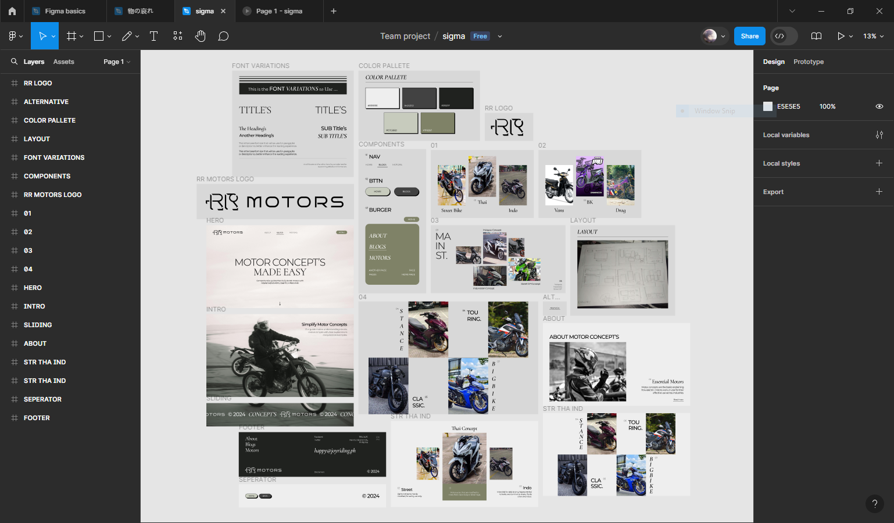
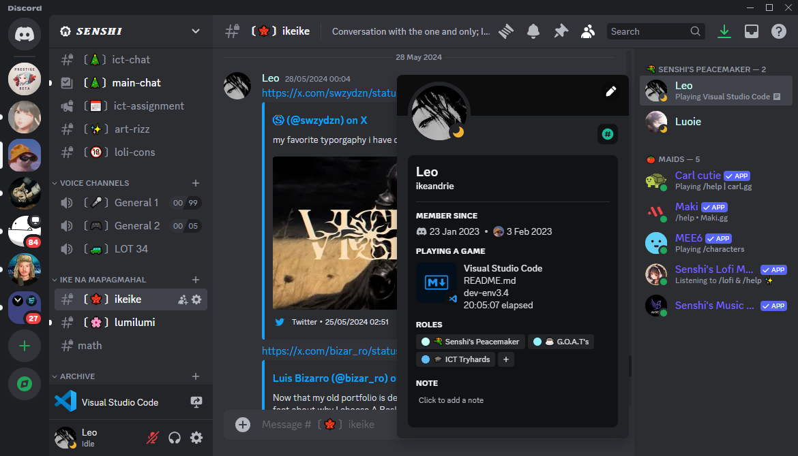

# web-design-inception

### Tech Stack:

- Vite (build tool/bundler)
- React (component base)
- Typescript
- Tailwind & Sass (for styling)
- Framer motion & Lenis scroll
- React Three Fiber
- Git (version control)
- Vercel (deployment)

### Tools:

- VsCode (vim bindings)
- Figma for web design/layout  
    
  

### To-do:

- VITE
 

- [x] Initial (React & Typescript ES6+)
- [x] Tailwind & prettier
- [ ] Update to typescript
- [x] Framer motion
- [x] Lenis scroll
- [x] R3F
- [x] Folder stucture
- [x] Clean up
 

- UTILS/STYLES (FIGMA)
 

- [x] Fonts
- [x] Variations
- [x] Sizes
- [x] Spacings
- [x] Weights
- [x] Color scheme (tailwind.config.ts)
- [x] Sass variables
 

- DRAFTS
 

- [x] Font varitaions page
- [x] Color pallete page
- [ ] UI components
 

- UI/UX
 

- [x] Navbar
- [x] Hero
- [x] Intro
- [x] Sliding
- [x] About
- [x] SCTB
- [x] STI
- [x] Footer
 

- COMPONENTS
 

- [ ] NAV
- [ ] BTTN
- [ ] BURGER
- [ ] Drop down
- [ ] 
 

- ANIMATIONS/INTERACTIVITY
 

- [x] Lenis scroll (for locomotive/smooth scroll)
- [x] Parralax text
	- [x] Directional & velocity scroll
- [ ] BURGER
- [ ] Button
- [ ] Dropdown
- [ ] Links (hover)
- [ ]
- [ ] NAV
- [ ] BTTN
 

- CRUTIALS
 

- [x] Update todo
- [x] Readme placeholder

- OPTIMIZATIONS (DRY)
 

- [ ] Json
- [ ] Mapping
- [ ] Fix repeated components

 
- MISCS
 

- [ ] Issues/bugs/to be added on Issues
